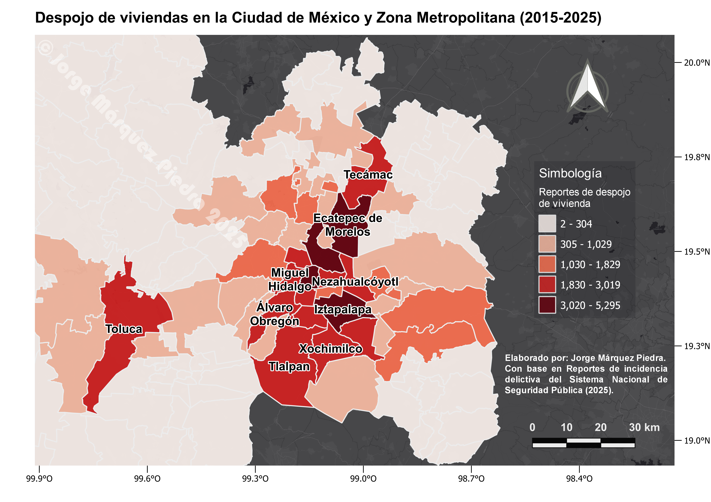
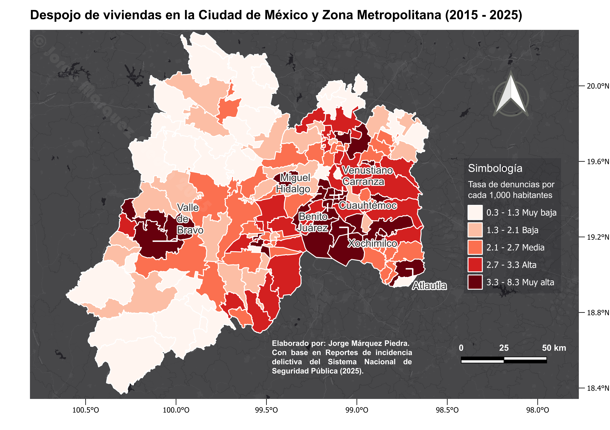
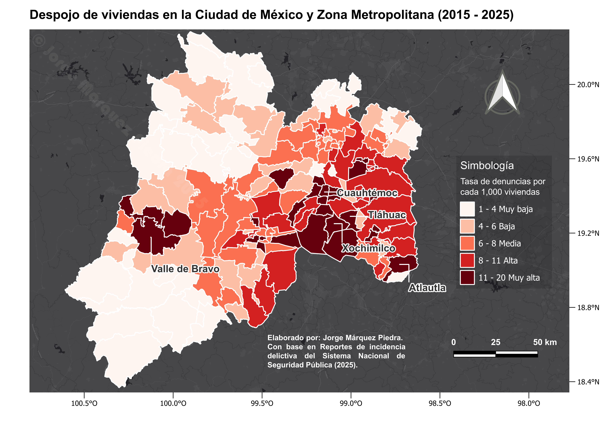

# Despojo-de-Vivienda-Ciudad-de-Mexico-y-Zona-Metropolitana-2015-a-2025-R

**Lenguaje: R**

**Sistema de Información Geográfica: QGIS**

**Librerías: sf, data.table**

**Entornos: RStudio / QGIS**

## Este repositorio contiene un análisis espacial sobre la incidencia delictiva relacionada con el despojo de viviendas en la Ciudad de México y la Zona Metropolitana. El proyecto examina una década de datos oficiales para identificar patrones espaciales, con el objetivo de comprender la distribución de esta problemática y generar evidencia para políticas públicas seguridad que garanticen la protección de la vivienda.

****
****
****

## Los datos fueron obtenidos del [Sistema Nacional de Seguridad Pública](https://www.gob.mx/sesnsp).
